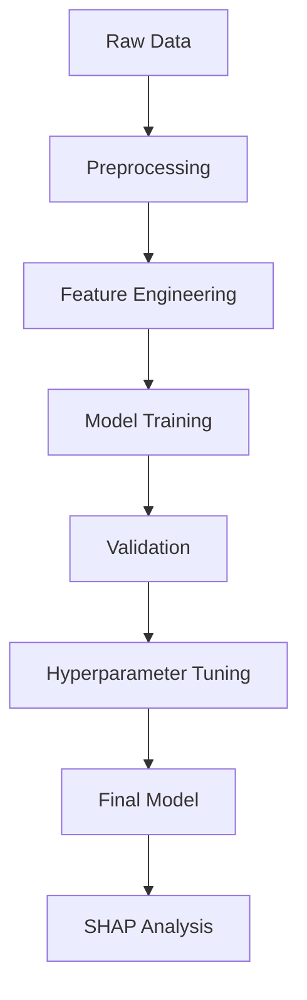

# Model Configurations and Technical Details

This document provides detailed technical specifications and configurations for all models used in the Start-Up Investment Outcome Prediction project.

## 🎯 Model Overview

The project implements an ensemble approach using multiple models:
1. Gradient Boosting (XGBoost)
2. Random Forest
3. Neural Networks (Multiple Configurations)
4. Logistic Regression
5. K-Nearest Neighbors
6. Decision Tree

## 📊 Data Preprocessing

### Feature Engineering
```python
# Key feature transformations
features = {
    'numerical_features': [
        'total_funding',
        'raised_amount',
        'investment_count',
        'num_funding_rounds'
    ],
    'categorical_features': [
        'job_type',
        'region',
        'country_code',
        'investor_type'
    ]
}

# Encoding schemes
encodings = {
    'categorical': 'one-hot',
    'ordinal_features': ['funding_rounds'],
    'numerical': 'standard_scaler'
}
```

### Data Split Configuration
```python
split_config = {
    'train_size': 0.6,
    'validation_size': 0.2,
    'test_size': 0.2,
    'random_state': 42,
    'stratify': True
}
```

## 🔧 Model Configurations

### 1. Gradient Boosting (XGBoost)
```python
xgboost_params = {
    'n_estimators': 100,
    'learning_rate': 0.3,
    'max_depth': 6,
    'min_child_weight': 1,
    'gamma': 0,
    'subsample': 0.8,
    'colsample_bytree': 0.8,
    'reg_lambda': 1,
    'objective': 'binary:logistic',
    'eval_metric': 'auc'
}
```

### 2. Random Forest
```python
random_forest_params = {
    'n_estimators': 10,
    'min_samples_split': 5,
    'max_features': 'sqrt',
    'bootstrap': True,
    'n_jobs': -1,
    'random_state': 42
}
```

### 3. Neural Networks

#### Configuration 1 (Best Performing)
```python
nn_config_1 = {
    'hidden_layers': [10],
    'activation': 'relu',
    'solver': 'adam',
    'alpha': 0.001,
    'max_iter': 1000,
    'learning_rate': 'adaptive'
}
```

#### Configuration 2
```python
nn_config_2 = {
    'hidden_layers': [5],
    'activation': 'identity',
    'solver': 'adam',
    'alpha': 0.001,
    'max_iter': 1000
}
```

#### Configuration 3
```python
nn_config_3 = {
    'hidden_layers': [5],
    'activation': 'tanh',
    'solver': 'sgd',
    'alpha': 0.01,
    'max_iter': 1000
}
```

#### Configuration 4
```python
nn_config_4 = {
    'hidden_layers': [5],
    'activation': 'identity',
    'solver': 'lbfgs',
    'alpha': 0.001,
    'max_iter': 200
}
```

### 4. Logistic Regression
```python
logistic_regression_params = {
    'penalty': 'l2',
    'C': 1.0,
    'solver': 'lbfgs',
    'max_iter': 100,
    'multi_class': 'ovr'
}
```

### 5. K-Nearest Neighbors
```python
knn_params = {
    'n_neighbors': 3,
    'weights': 'uniform',
    'algorithm': 'auto',
    'metric': 'euclidean'
}
```

### 6. Decision Tree
```python
decision_tree_params = {
    'criterion': 'gini',
    'splitter': 'best',
    'max_depth': 100,
    'min_samples_leaf': 3,
    'min_samples_split': 5
}
```

## 📈 Model Performance Metrics

### Evaluation Metrics
```python
metrics = {
    'accuracy': accuracy_score,
    'precision': precision_score,
    'recall': recall_score,
    'f1': f1_score,
    'auc_roc': roc_auc_score,
    'matthews_corr': matthews_corrcoef
}
```

### Best Model Results (Gradient Boosting)
```python
results = {
    'auc': 0.993,
    'accuracy': 0.996,
    'f1_score': 0.954,
    'precision': 0.996,
    'recall': 0.916,
    'matthews_corr': 0.953
}
```

## 🔍 SHAP Configuration

```python
shap_config = {
    'model_output': 'probability',
    'feature_perturbation': 'tree_path_dependent',
    'check_additivity': True
}
```

## 🚀 Training Pipeline

```python
pipeline_config = {
    'preprocessing': {
        'numerical': StandardScaler(),
        'categorical': OneHotEncoder(sparse=False),
        'imputation': SimpleImputer(strategy='median')
    },
    'feature_selection': {
        'method': 'SelectFromModel',
        'estimator': XGBClassifier()
    },
    'cross_validation': {
        'n_splits': 5,
        'shuffle': True,
        'random_state': 42
    }
}
```

## 📊 Validation Strategy

1. **Cross-Validation**
   - 5-fold stratified cross-validation
   - Maintain class distribution in each fold

2. **Hyperparameter Tuning**
   - Grid search for optimal parameters
   - Randomized search for neural networks
   - Bayesian optimization for XGBoost

3. **Model Selection**
   - Based on ROC-AUC score
   - Considering F1 score for imbalanced classes
   - Matthews correlation coefficient for overall performance

## 🔄 Data Flow



## 💾 Resource Requirements

### Minimum Requirements
```python
system_requirements = {
    'ram': '16GB',
    'cpu_cores': 4,
    'storage': '50GB',
    'python_version': '>=3.8'
}
```

### Recommended Requirements
```python
recommended_requirements = {
    'ram': '32GB',
    'cpu_cores': 8,
    'storage': '100GB',
    'gpu': 'Optional for Neural Networks'
}
```

## 📝 Model Versioning

```python
version_info = {
    'major': 1,
    'minor': 0,
    'patch': 0,
    'date': '2023-09',
    'framework_versions': {
        'orange_data_mining': '3.35.0',
        'scikit-learn': '1.0.2',
        'xgboost': '1.5.0',
        'shap': '0.40.0'
    }
}
```